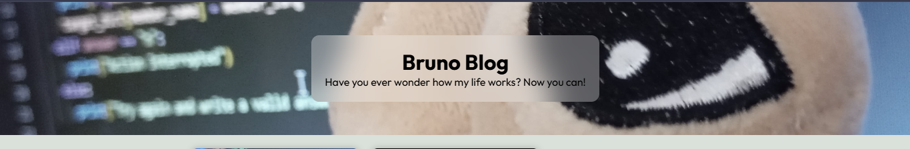
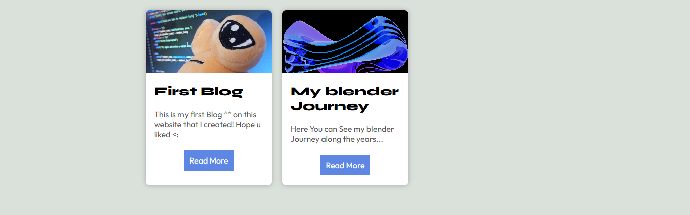
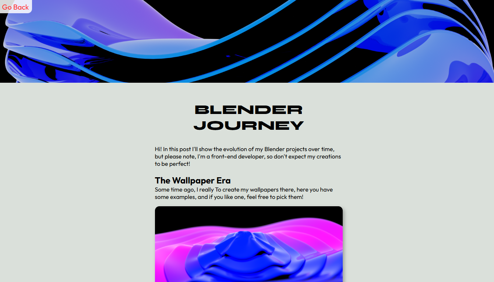
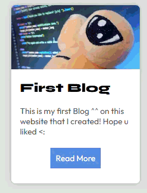
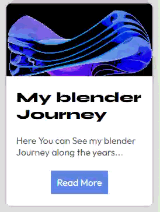
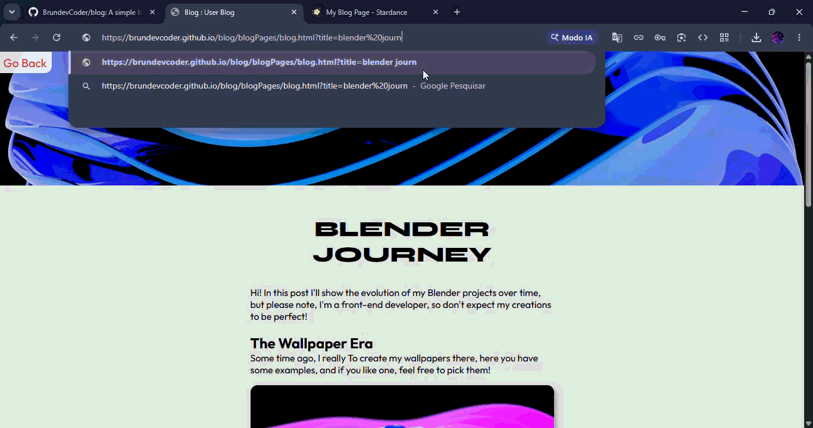
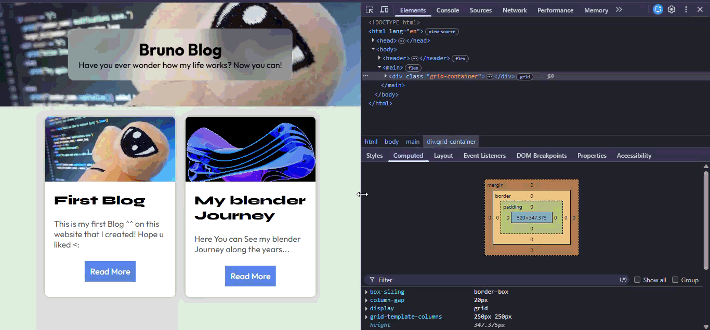
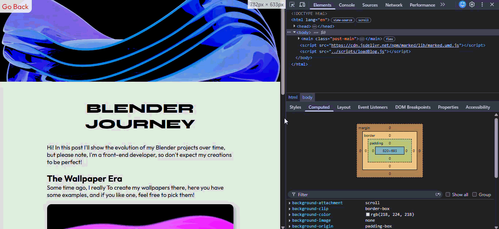

# My personal Blog

Now, anyone can learn more about me with each post on my blog!

## How it works?

Well, on the homepage, you have the blogs you can view. When you click to read more, the code sends you to a blog page template, `blog.html`, with special URL parameters. When you arrive at that page, the code reads the parameters and looks for one called "title". If there's a `.md` file and an image with that text, it will display it.

## About the design:
I decided to create a modern and clean UI, here are some screenshots:

The banner:

The Blog cards:

A blog page:

Another very important thing I worked on was creating animations/actions that depended on the user, here are some examples:

### Hover animations on the post card:

### Read More Button Hover Animation:

### Go Back button Hover Animation:

Another important thing I did was to display this message on the page when the files for a post are not found or do not exist:

Last but not least, responsiveness, something that is very essentioal on the web! You can see this videos of it:

Hope you liked!